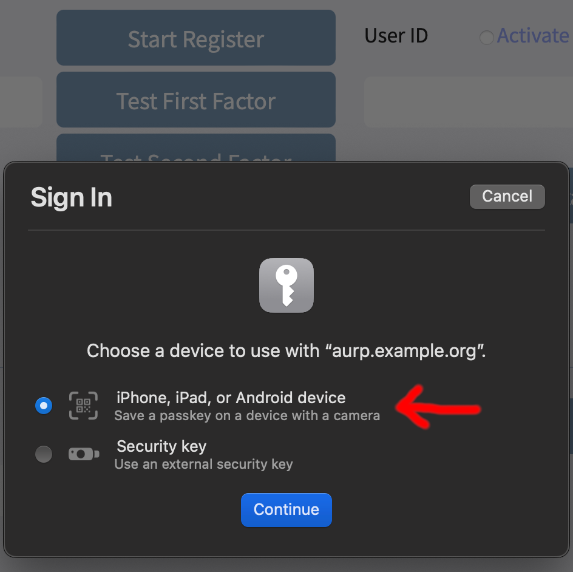
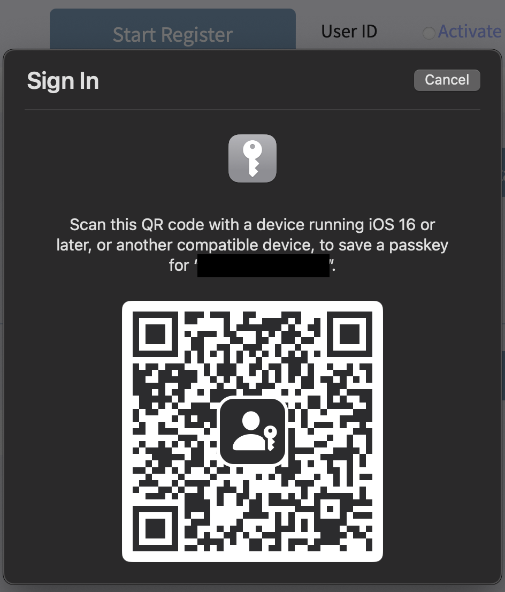
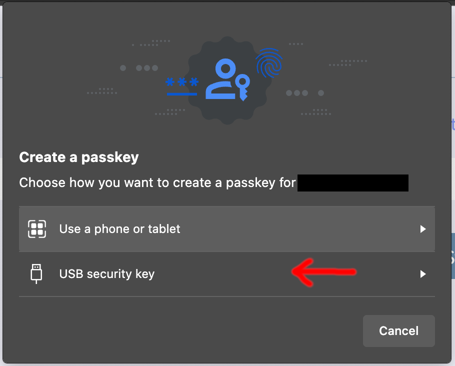
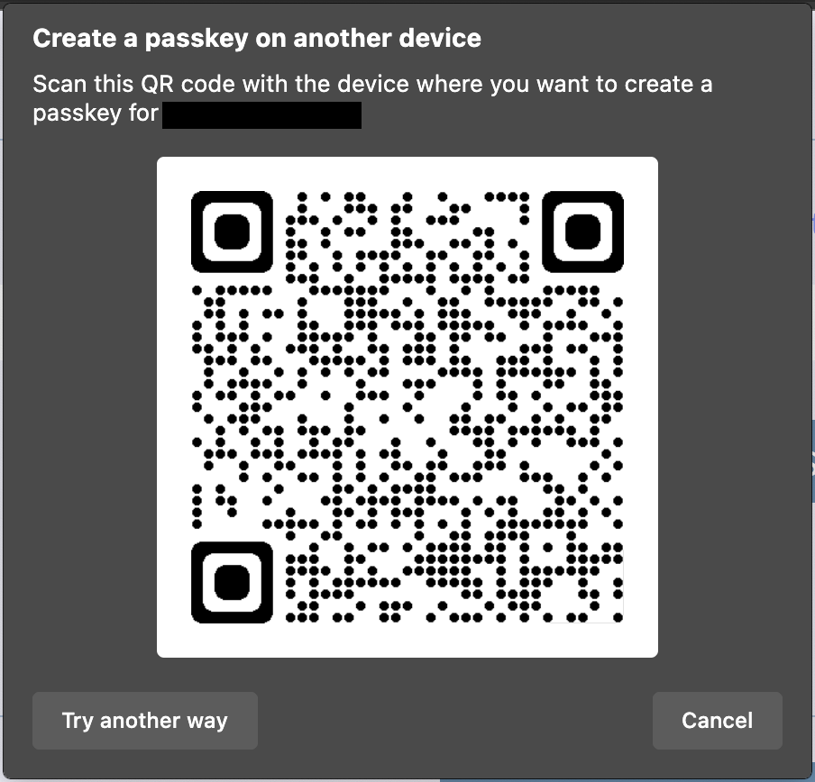

# Mobile Device with Passkey to work with WebAuthn

For mobile devices with Android >= 14 or iOS >= 16, iPad OS >= 16, Google and Apple anounce Passkey so user can sync credential and key between terminal devices.    
    
For devices with Android < 14 or iOS < 16, iPad OS < 16, please see [Non_Passkey.md](Non_Passkey.md)    

### Requirement

Using Passkey with PC/Mac, you'll need:

- Make sure computer has Bluetooth
- Update OS to lastest update
	- Windows 10 > 1903
	- Windows 11 > 22H2
	- Mac OS > 13

### WebAuthn on PC/Mac

Here explane how mobile device with Passkey work as external security key for computer.

#### Registration

When try to register new security key with ```authenticatorAttachment: cross-platform```, browser will show new feature so you can register Passkey with computer.

Safari on Mac



Microsoft Edge on PC



Google Chrome on PC/Mac


Turn on QRCode scanner on mobile device and scan QRCode, mobile will connect to computer and ask for biometric verification.    
After verified, mobile device will register a credential for you.    
    
**If you wish to login with FIDO as first factor, please use ```requireResidentKey: true``` and ```residentKey: "required"```, ```residentKey: "preferred"```**    
    
In the sample, we can use dafualt parameters in ```webauthn.js```to do the register.

#### Verification

The FIDO verification will goes with same way as registration. Click the verify button on computer UI, use mobile device to scan the QRCode. After biometrics verified, you are able to login to system.

### WebAuthn on mobile devices

#### Registration

On mobile web page or in App, register with parameter ```authenticatorAttachment: platform```, mobile device will show biometrics for user to do the verification. After biometrics verified, mobile device will create a new credential for the web service. Send credential response back to server, and wait for AuthFi system's response.    
    
You can use server sample API ```POST /api/register```, ```PUT /api/register``` to do registration between mobile device and AuthFi.

#### Verify

On mobile web page on in App, click any trigger and call for server API ```POST /api/login```, ```PUT /api/login``` for first factor login. Or use ```POST /api/identity```, ```PUT /api/identity``` for second factor login. Biometrics verification will show up. And after verified, mobile device will return credential and signature. Send those information back to AuthFi server and wait for result.
